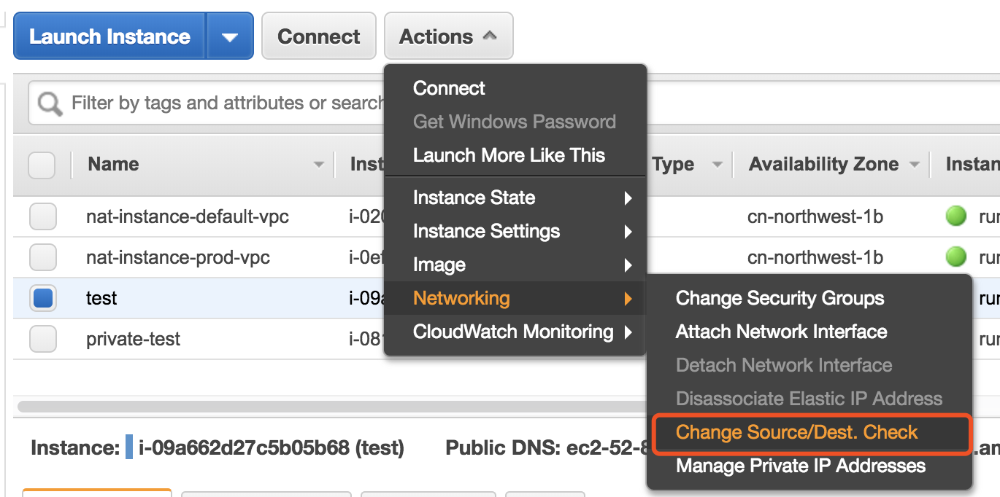
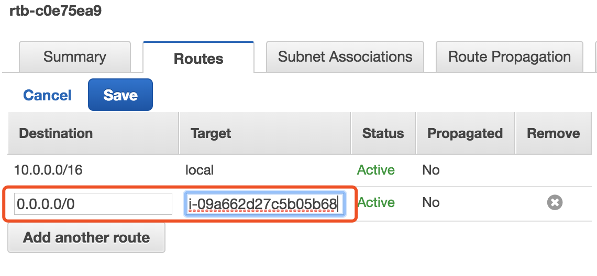

# Transparent Proxy

## Introduction

This solution setups up one proxy server in AWS global region, one NAT instance in AWS China (Beijing/Ningxia) region. The NAT instance will perform IP based routing. For all TCP packets sending to China IP addresses, NAT instance will route them through default route. For all other TCP packets, NAT instance will redirect them to the proxy server in AWS global region.  

## Setup

1. deploy a proxy server in AWS global region

    In one AWS global region (N. California is recommended), launch an instance with this AMI (ami-031993dcc3be19f5c). Open port 8443 for inbound TCP and UDP in the security group.

    Login this instance (username is ec2-user) with your key pair. Change the password in file: /etc/shadowsocks-libev/ss-server.json.

    ```bash
    {
        "server_host": "0.0.0.0",
        "server_port": 8443,
        "password": "change-this-password",
        "timeout": 60,
        "method": "chacha20",
        "fast_open": false
    }
    ```

    Then restart the shadowsocks server.

    ```bash
    sudo systemctl restart shadowsocks-libev.service
    ```

    Check its status to make sure it is running.

    ```bash
    sudo systemctl status shadowsocks-libev.service
    ```

2. deploy a nat instance to AWS China region

    In AWS China region (Beijing/Ningxia), in your existing VPC with both private and public subnetes, launch one instance with this AMI (ami-406a7d22). Allow all inbound transfic from you VPC CIDR in security group.

    Login this instance. Update the configuration file with server ip and password in step 1.

    ```bash
    {
        "server": "remote-server-ip",
        "server_port": 8443,
        "local_address":"0.0.0.0",
        "local_port": 1080,
        "password": "remote-server-password",
        "timeout": 60,
        "method": "chacha20",
        "fast_open": false
    }
    ```

    Restart ss-redir service.

    ```bash
    sudo systemctl restart shadowsocks-redir.service
    ```

    Check its status to make sure it is running.

    ```bash
    sudo systemctl status shadowsocks-redir.service
    ```

    Next edit file /etc/sysconfig/iptables, update remote server ip and local redir port.

    ```bash

    # Uncomment the line below and replace $REMOVE_SERVER_IP with the remote shadowsocks server ip address.
    #-A SHADOWSOCKS -d $REMOVE_SERVER_IP/32 -j RETURN

    ...

    # Uncomment the line below and replace $LOCAL_REDIR_PORT with local ss-redir listening port
    #-A SHADOWSOCKS -p tcp -j REDIRECT --to-ports $LOCAL_REDIR_PORT

    ```

    Then reload the iptable rules.

    ```bash
    sudo systemctl reload iptables.service
    ```

    Check the iptable rules are loaded correctly.

    ```bash
    sudo iptables -t nat -L -n
    ```

3. disable source/target check for the nat instance

    In AWS China region console (console.amazonaws.cn), select the new nat instance, and disable the source/target check.

    

4. Configure the routing table for private subnets

    Update routing table associated with the private subnets, point the default route to the new nat instance.

    

5. verify the setup

    Login into one instance in your private subnet, Use the following command to see if the transparent proxy is working.

    ```bash
    curl -v https://cloud.google.com/container-registry/
    ```
    You should see html contents in the output.